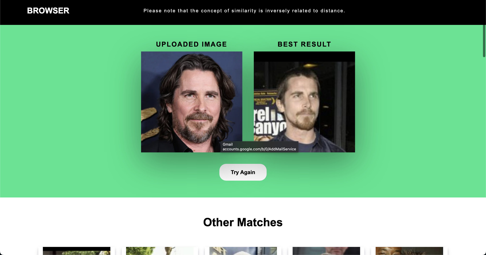

<br>
<p align="center">
    

<h3 align="center">VisualMatch</h3>

<p align="center">
    Efficient image search using high-dimensional techniques for accurate similarity retrieval.
</p>

<p align="center"


 


<p align="center"

Project for DB2 course that allows you to perform image search based on similarity using the K-Nearest Neighbors (KNN) algorithm. It provides a user-friendly interface where you can upload an image and retrieve the most similar images from a pre-populated [image database]((http://vis-www.cs.umass.edu/lfw/)).

## Features 

- Upload an image to search for **similar images** using a 128 dimension vector per image.
- Specify the value of **K** to control the number of similar images **to retrieve**.
- Display the **best match** image along with other relevant search results.
- Show the **names** and **distances** of the search results.
- ```FAISS``` implementation
- ```R-Tree``` implementation
- ```Sequential``` implementation
- Comparison between search algorithms.

## Installation

1. Clone the repository:

```bash
git clone https://github.com/your-username/image-search-app.git
# then open the folder
```

**Recomended**: Use conda to manage the environment and easily install all libraries

Updates an environment called ```my_env``` with the data from the .yaml

```bash
$ conda env update -n my_env --file environment.yaml
```

Create a new environment
```bash
$ conda env create -f environment.yml
```

Activate the environment
```bash
$ conda activate bdd3
```

If you want to use pip instead, use:
```bash
pip install -r requirements.txt
```

#### Libraries:
- Python 3.10 **(Python 3.11 won't work)**
- Flask 
- NumPy
- [Face Recognition]((https://github.com/ageitgey/face_recognition))
- [Faiss]((https://engineering.fb.com/2017/03/29/data-infrastructure/faiss-a-library-for-efficient-similarity-search/)) (for high-dimensional search)
- Sequential and Rtree (for alternative KNN search methods)

### Usage

**[Optional]** Run the ```startup.py``` file, it will create the encodings ```(encodings.pickle)``` and the r-tree. It will take a few minutes if done with the ```HOG``` algorithm and a couple hours if done with ```CNN```.
```bash
python startup.py
```

Then just run the app

```bash
python app.py
```

Access the application by visiting http://localhost:5000 or http://127.0.0.1:5000 in your web browser.

Upload an image using the provided interface.

Enter the value of K (number of similar images to retrieve) if not, it's 5 by default.

<p align="center">


</p>

### Additional Search Methods
To implement alternative KNN search methods (such as sequential search or Rtree), follow these steps:

The Flask route
```py
@app.route('/upload', methods=['GET', 'POST'])
def upload_pic(): 
```
calls the search method function
```py
results, names, similarity_scores, best_result = highd_knn(img, numeric_value)
```

The search method function
```py
# loads the "Database"
r_data = pickle.loads(open("encodings.pickle", "rb").read())

# turns the given image into a cv2 image
img_array = np.frombuffer(img, np.uint8)
image = cv2.imdecode(img_array, cv2.IMREAD_COLOR)

# compares and generates results
# finally returns

# images[1:] -> resultados (without the best result) <class 'list' <class 'str'> >
# f_names[1:] -> names (without the [0] which is the best result) <class 'list' <class 'str'> >
# D[0][1:] -> all distances (generated by FAISS algorithm) <class 'numpy.ndarray' <class 'numpy.float32'> >
# images[0] -> best result image path <class 'str'>

return images[1:], f_names[1:], D[0], images[0]
```

With that in consideration, the frontend should work with the new search algorithm !