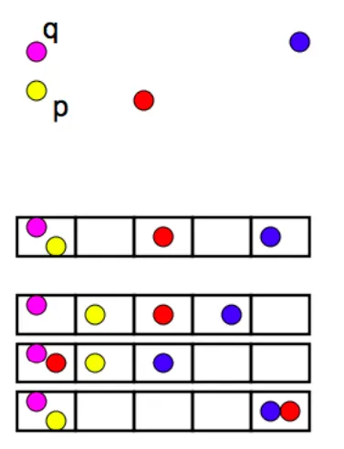
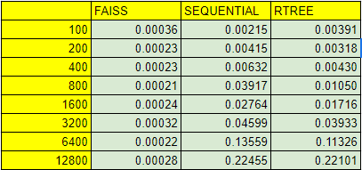
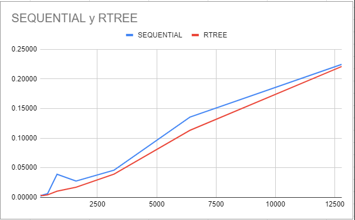
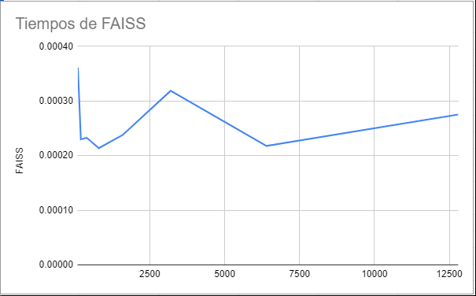

# Introduccion
Proyecto para el curso de DB2 que permite realizar búsqueda de imágenes basada en similitud utilizando el algoritmo de los K-Vecinos Más Cercanos (KNN). Proporciona una interfaz amigable donde puedes cargar una imagen y recuperar las imágenes más similares de una [base de datos de imágenes]((http://vis-www.cs.umass.edu/lfw/)) preexistente.

## Características

- Sube una imagen para buscar **imágenes similares** utilizando un vector de 128 dimensiones por imagen.
- Especifica el valor de **K** para controlar el número de imágenes similares **a recuperar**.
- Muestra la imagen de **mejor coincidencia** junto con otros resultados de búsqueda relevantes.
- Muestra los **nombres** y **distancias** de los resultados de búsqueda.
- Implementación de ```FAISS```.
- Implementación de ```R-Tree```.
- Implementación ```Secuencial```.
- Comparación entre algoritmos de búsqueda.

# Librerias Utilizadas

Para la implementacion hemos utilizado las siguientes librerias:

- face_recognition
- faiss (cpu o gpu)
- rtree
- opencv
- otras incluidas con python.
  
# Tecnicas de indexacion de las librerias utilizadas

Utilizamos dos librerias qde indexacion para este proyecto. A continuacion describimos los metodos de indexacion que utilizan.

## Rtree:
La libreria Rtree utiliza un arbol R. Este es una estructura semejante al arbol B, pero que se compone de cuadrados, cubos e hipercubos segun la dimensionalidad de los datos a indexar sea. La idea es que cada nodo define una lista de 'bounding boxes' minimales para un conjunto de 'bounding boxes' hijas, de tal forma que se puede determinar una cota inferior a todos los puntos dentro de la 'bounding box' en cada nivel del arbol, eventualmente llegando a nodos hoja que contienen solo puntos. En la implementacion utilizada, los nodos hoja son representados como un hipercubo donde la lista de min(x,y,z...) = max(x,y,z...). Esto tiene implicancias para la busqueda, pues requiere duplicar la cantidad de parametros de busqueda antes de utilizar la API que la libreria ofrece.


## Faiss:
Estamos utilizando el indice IndexLSH de la libreria FAISS, que lo que hace (segun lo que hacen los indices de este tipo) es utilizar una funcion hash con la propiedad de que los vectores similares colisionen o se acerquen. (la idea es contraria a lo que se trata de hacer en un hash normal). De esta manera, logra reducir el problema multidimensional a una sola dimension. (Elegimos esta tecnica porque justamente muestra que pasa cuando el problema de la dimensionalidad alta se aborda).



# Maldicion de la Alta Dimensionalidad

La maldicion de la alta dimensionalidad es un fenomeno que ocurre conforme se incrementan las dimensiones de los vectores caracteristicos. hace referencia a que a mas dimensiones, mas esparsos parecen los datos, y mas dificil resulta encontrar grupos.

Hemos observado el problema de la alta dimensionalidad en nuestro Rtree: (al tener datos demasiado esparsos, las 'bounding boxes' resultan cada ves menos informativas, se solapan, etc). Esto hace que la performance del indice tienda mas y mas a lineal, como vemos en nuestra experimentacion. Una solucion obvia para el problema de la dimensionalidad es reducir las dimensiones, pero al hacer esto (vimos en la practica) que la exactitud de nuestra busqueda era considerablemente menor. Esto tiene sentido, porque a menos datos para tomar una descicion, mas probable es equivocarse.

Como se menciono anteriormente nuestra solucion al problema de la dimensionalidad es utilizar tecnicas como el LHS, que en cierta forma reducen la dimensionalidad del problema. Esto nos permite mantener la informatividad de nuestro indice sin sacrificar la precision de la busqueda.

# Experimentacion:

Hicimos una serie de consultas a nuestro sistema, utilizando siempre la imagen 'Aaron_Patterson_0001.jpg', que siempre pertenecia al conjunto indexado, y con k=8 para los knn. Generamos un archivo de encodings para toda la base de datos (Puede encontrarlo en `flakapp/full_encodings.pickle`), y por cada uno de los incrementos en N en la tabla a continuacion generamos el subconjunto de imagenes indexadas `encodings_full[0:N]` en el archivo de vectores `../encodings.pickle`. Luego, en base a esto, generamos un nuevo Rtree. Todo esto lo hace el script `startup.py`. Despues realizamos una seguida de la otra las consultas con la estrategia secuencial (aprovechamos para que el secuencial cuente de forma independiente las imagenes por las que pasa, garantizando que estamos trabajando con la cantidad de datos que creemos), la estrategia FAISS y la estrategia Rtree. Tomamos una medicion por cada par (N,tecnica) en la tabla. Notar que la mayoria del tiempo de consulta se pasa en la extraccion de caracteristicas de la imagen de query. En la tabla se muestra solo la fraccion del tiempo de la query que se pasa buscando el vector ya generado en la base de datos, es decir, donde el indice hace la diferencia.



A continuacion graficamos todas las tecnicas:



Vemos que la tecnica secuencial es semejante en tiempos a la de el Rtree. Cremos que esto se debe a la alta dimensionalidad. No creemos que el problema sea que los datos del secuencial estan en RAM, porque utilizamos un generador asociado al archivo pickle y no un dict real. 



Hemos graficado los resultados del LHS de manera independiente porque no se aprecia correctamente al graficarlo con los dos anteriores, ni siquiera con ajuste logaritmico. Creemos que esta tecnica muestra una forma tan particular porque al ser una tecnica que usa hashes, el tiempo resulta *mas o menos* constante, en particular con la cantidad de datos que tenemos que aun es relativamente reducida (notar que el indice trabaja sobre 13000 vectores, no imagenes).

# Analisis y discusion

Del proyecto encontramos los siguientes puntos importantes:

- La maldicion de la alta dimensionalidad ocurre cuando la cantidad de dimensiones genera que los datos sean dificiles de agrupar. Esto impacta a los metodos de indexacion que dependen de la agrupacion de los puntos de forma negativa.
- El indice Rtree es propenso a la maldicion de la alta dimensionalidad.
- La busqueda secuencial se aproxima al performance del Rtree conforme se aumenta la dimensionalidad.
- El indice LHS de Faiss es ordenes de magnitud mas rapido que los demas, en parte por una implementacion mas eficiente y por la forma del indice.

En general el indice LHS de FAISS resulto ser mucho mejor al indexar los vectores en terminos de tiempo. Sin embargo, el espacio que ocupa este indice en RAM no ha sido medido, y podria ser considerable dado que esta es una tecnica basada en hash. Tambien es importante considerar que la busqueda en el LHS esta ocurriendo en RAM, aunque estamos cargando los datos inicialmente desde el disco. Esto podria explicar parte de la ventaja que tiene LHS frente a nuestras implementaciones, cuya busqueda ocurre desde un objeto generador (en el caso de la sequential) y desde la implementacion de lectura del disco que utilice el Rtree.

# Bibliografia
https://towardsdatascience.com/understanding-locality-sensitive-hashing-49f6d1f6134
https://github.com/facebookresearch/faiss/wiki/Faiss-indexes
https://rtree.readthedocs.io/en/latest/
https://towardsdatascience.com/the-curse-of-dimensionality-50dc6e49aa1e
https://github.com/emilrezanina/RTree (Fotografias del Rtree)